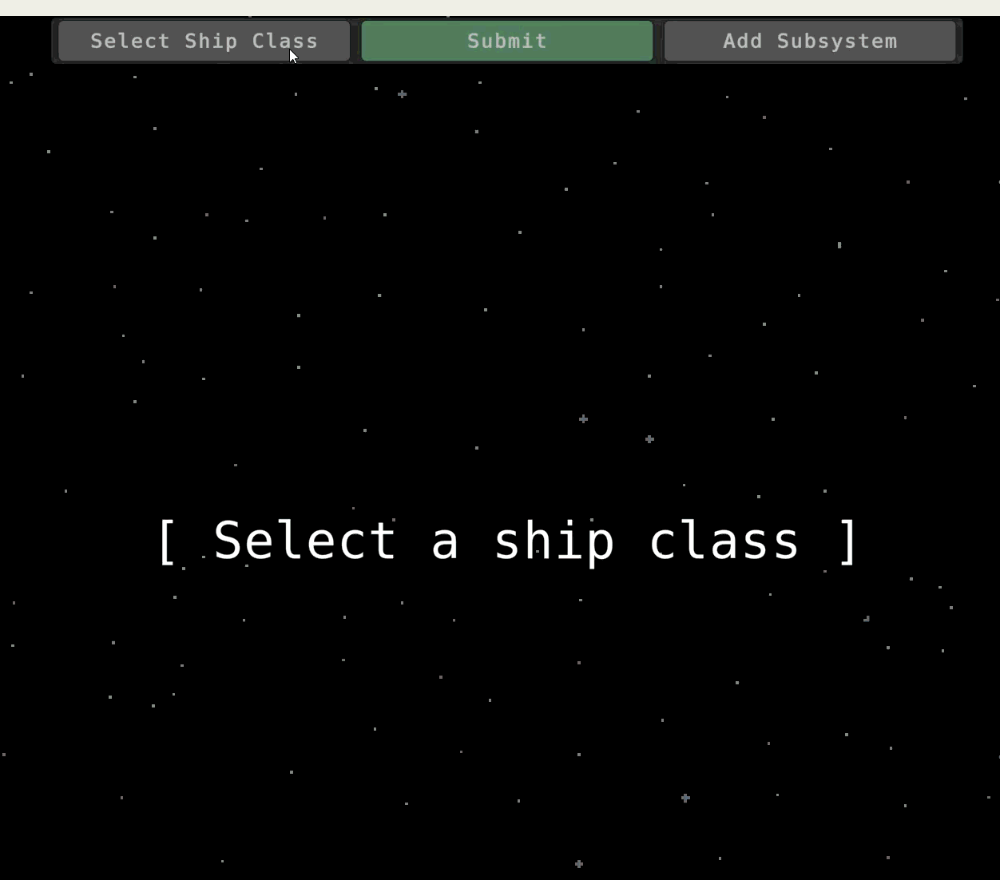
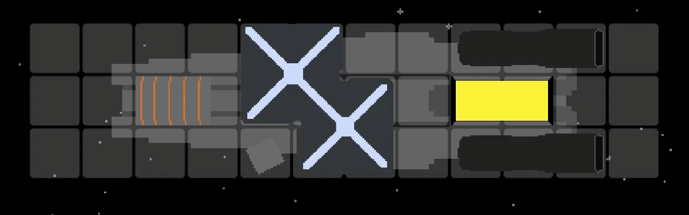

# Assembly
# About
Assembly is a game about designing starships for a variety of clientele. Whip up a design for Whitebeard and his crew so that they can hold up merchant ships, or help Admiral Hood introduce a new line of corvettes for his fleet.

# Download
See the [releases page](https://github.com/Fredrick117/Assembly/releases) or the [itch.io page](https://cfredrick.itch.io/assembly).

# Gameplay
## Customer request
Before you start making your own starship, it's important to take a quick look at what the customer is requesting from you. They're paying you, after all!

Requests have two parts: a hidden check to see if the design you've submitted is actually space-worthy (has enough power to ensure all subsystems are able to function, has thrusters, and a reactor), and the request itself. The latter requires the ship's design to have specific stats, such as a minimum/maximum speed, mininmum/maximum armor rating, the ability to be flown autonomously, etc.

*A sample request, showing that John from Earth wants a destroyer and is willing to pay 43,750 credits for it.*

## Ship classifications
Designing a ship first involves selecting its classification. This classification decides how large the starship is and how many subsystems it can hold. Currently, there are 5 classes of ships you can design:
- Escort
- Corvette
- Destroyer
- Cruiser
- Carrier

## Subsystems
Each ship type can hold a certain number of 'subsystems'. Subsystems are modules that can be added to a ship to give it certain stats such as speed, shield strength, armor rating, mass, and so on. Subsystems are added to your design using a grid system, so you may have to get creative with how these subsystems are oriented if you start to run out of space.

## Submitting your design
Once you're satisfied with your design, you can press the submit button at the top. If your ship design is not space-worthy, you'll get _no_ reward, but if you correctly satisfy the customer's request, then you'll get a nice sum of credits!

*An example of a finished destroyer design, complete with an FTL drive, metal hull plating, two small thrusters, a light shield generator, and a tier II reactor!*
